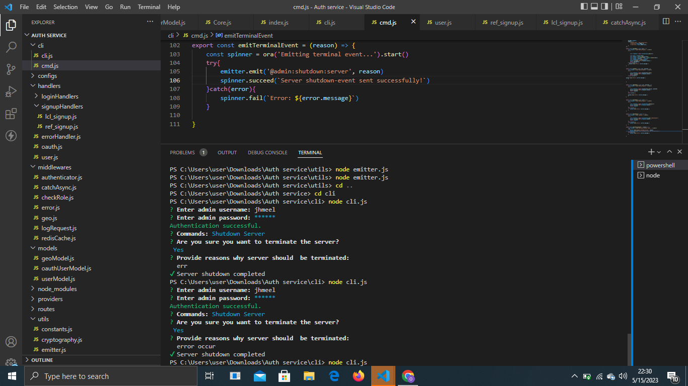
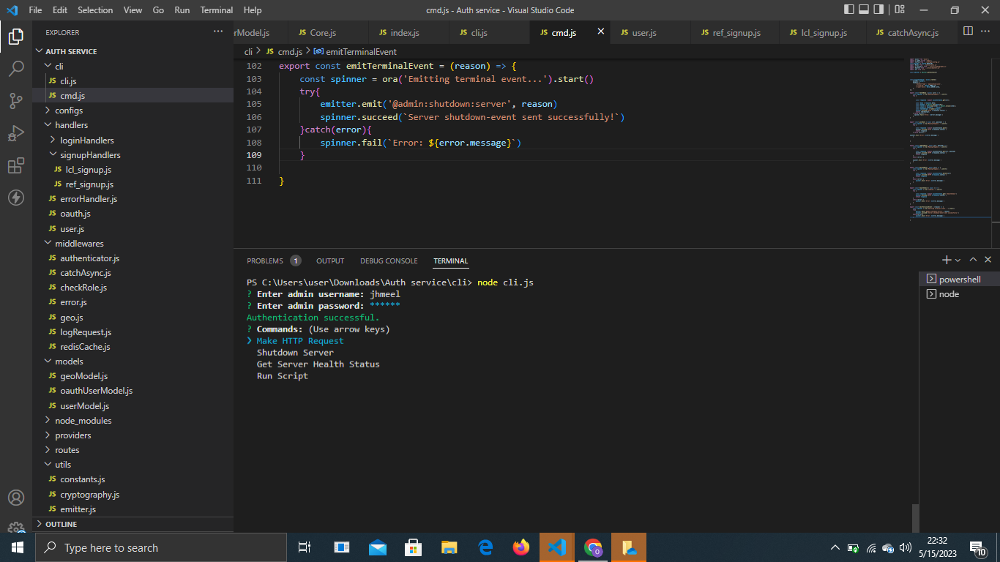
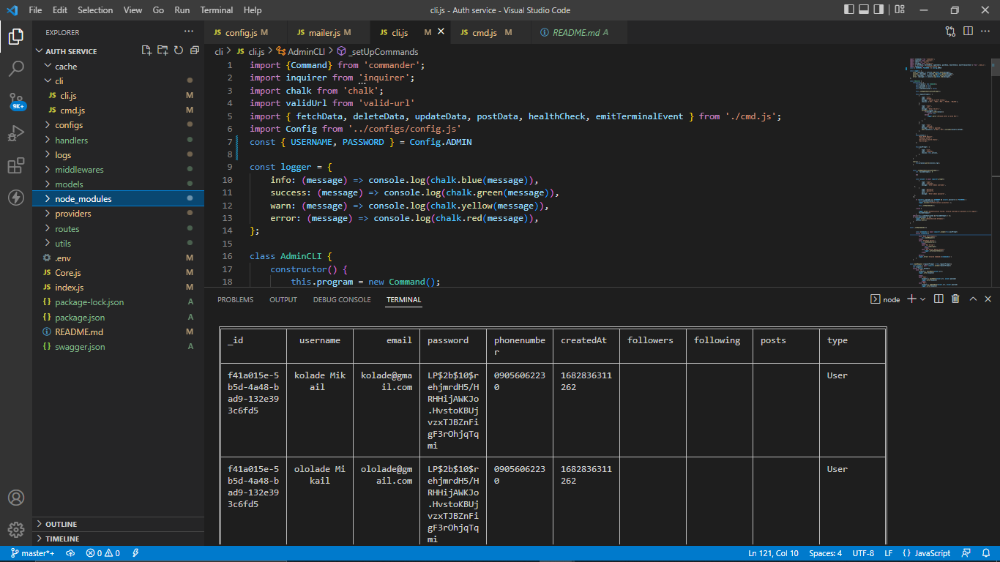

# Serverpoll 
## Description

Serverpoll is a CLI tool designed to interact and also monitor the status of a  server be it in production or in development and to provide real-time updates. 

This readme will guide you through the necessary steps to configure and run the program effectively.





## Prerequisites

Before running ServerPoll, ensure that you have the following installed:

Node.js (vers ion 12 or higher)

npm (Node Package Ma nager)

##Installation

To install the required dependencies, run the following command in your terminal:

```bash
npm install
```

## Configuration

ServerPoll requires a configuration file to specify the server URL and other Adminstrative corresponding settings. Follow these steps to configure the program:

Loca te the config.js file in the project

Adjust any other settings in the config.js file according to your requirements.

## Running the Program

```bash
npm run  dev
```
## ServerPoll Commands


-Get HealthCheck ⚠️Server needs to be configured  with express-healthcheck to use this command.

-Make Request ⚠️Needs configuration with your server routes.

-Terminate Server ⚠️Server needs to listen for shutdown event to use this.

-Run script ...

⚠️ You can customize the command list to add more command as needed.


## Feedback and Support

If you encounter any issues or have suggestions for improvements, please feel free to open an issue or contribute.






